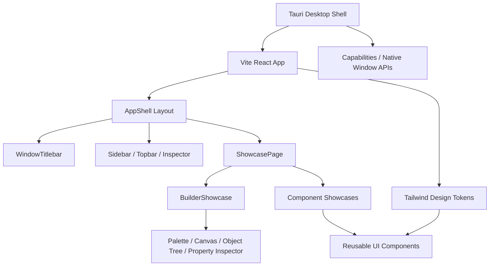

# Nova UI Kit

Nova UI Kit is a modern desktop UI kit and drag-and-drop interface builder built with Tauri, React, TypeScript, Tailwind CSS, Radix UI, shadcn/ui-style components, and lucide-react.

The project has two goals:

- Provide a polished desktop component playground similar to a lightweight Storybook.
- Provide a simple Qt Designer-like builder so users can quickly compose desktop interfaces and export them toward a Tauri executable.

Repository: https://github.com/sorrowfeng/nova-ui-kit

## Highlights

- Desktop-first UI workbench, not a marketing landing page.
- Tauri v2 desktop shell with custom titlebar and native window controls.
- React + TypeScript frontend powered by Vite.
- Tailwind CSS design tokens with light/dark themes and density modes.
- shadcn/ui-style reusable components in `src/components/ui`.
- Radix UI primitives for accessible dialogs, dropdowns, popovers, tabs, selects, switches, toasts, and tooltips.
- lucide-react icon system.
- Drag-and-drop interface builder with templates, canvas, object tree, property inspector, local save, preview, and JSON/React export.
- MIT licensed.

## Interface Builder

The Builder is the default first screen. It is designed to be the simplest path from idea to desktop UI.

Current Builder capabilities:

- Click or drag controls from the component palette into the canvas.
- Start from quick templates such as Dashboard, Settings Panel, or Blank Canvas.
- Select canvas nodes and edit their properties from the inspector.
- Reorder nodes by dragging on the canvas or using the object tree.
- Edit page-level settings such as title, canvas width, background, and autosave.
- Save and restore the current builder state from local storage.
- Switch between Design, Preview, and Export modes.
- Export Builder JSON for persistence or React JSX for integration into a Tauri/React app.

Current export pipeline:

```text
Builder canvas
  -> Builder JSON or React JSX
  -> React/Tauri project integration
  -> Tauri build
  -> desktop executable
```

The next natural step is a real project generator command in the Rust/Tauri backend that turns Builder JSON into files and runs the Tauri build pipeline automatically.

## Tech Stack

```text
Tauri v2
React 18
TypeScript
Vite
Tailwind CSS
Radix UI
lucide-react
Rust
```

## Architecture



### Frontend

`src/` contains the React application:

- `src/App.tsx` manages active page, search, theme, color scheme, density, command palette, and toast state.
- `src/components/layout/` contains the desktop shell UI: custom titlebar, rail navigation, sidebar, topbar, inspector, and status bar.
- `src/components/ui/` contains reusable shadcn/ui-style primitives.
- `src/components/showcase/` contains the component playground and the drag-and-drop Builder.
- `src/data/` contains demo data and the component registry.
- `src/index.css` and `tailwind.config.ts` define design tokens, themes, density variables, shadows, radius, and animations.

### Desktop Shell

`src-tauri/` contains the Tauri application:

- `src-tauri/tauri.conf.json` configures the app window, build output, and bundling.
- `src-tauri/capabilities/default.json` grants the custom titlebar permission to drag, minimize, maximize, and close the window.
- `src-tauri/src/main.rs` uses the Windows GUI subsystem in release mode, so double-clicking the exe does not show a console window.
- `src-tauri/src/lib.rs` initializes the Tauri app and plugins.

### Backend Logic Strategy

The current backend layer is Rust, provided by Tauri. For most native desktop logic, the recommended path is:

1. Keep UI, interaction, and design-system state in React/TypeScript.
2. Put filesystem, project generation, native OS integration, build orchestration, and performance-sensitive local logic in Rust Tauri commands.
3. Call those commands from the frontend through Tauri's invoke API.

Rust fits this project well because it is already part of Tauri, produces small native binaries, has strong safety guarantees, and can call into platform APIs without shipping a separate runtime.

C++ is still a good option when you already have an existing C++ library, need a specialized native engine, or want to share core logic with another C++ product. The usual integration paths are:

- Rust FFI wrapper around a C/C++ static or dynamic library.
- A dedicated sidecar executable that the Tauri app launches and talks to over stdin/stdout, HTTP, gRPC, or a local socket.
- A thin C ABI boundary if the C++ module should stay independent from the Tauri app internals.

Other languages can also work as sidecars. Go is a strong fit for small local services, Python is useful for scripting or AI/data workflows, and Node.js can be useful when reusing existing JavaScript tooling. For this repository, Rust should remain the default backend unless there is a concrete reason to introduce another runtime.

## Project Structure

```text
nova-ui-kit/
├─ src/
│  ├─ App.tsx
│  ├─ main.tsx
│  ├─ index.css
│  ├─ lib/
│  │  └─ utils.ts
│  ├─ data/
│  │  ├─ components.ts
│  │  └─ demo.ts
│  └─ components/
│     ├─ ui/
│     ├─ layout/
│     └─ showcase/
│        └─ BuilderShowcase.tsx
├─ src-tauri/
│  ├─ capabilities/
│  │  └─ default.json
│  ├─ src/
│  │  ├─ main.rs
│  │  └─ lib.rs
│  ├─ Cargo.toml
│  └─ tauri.conf.json
├─ tailwind.config.ts
├─ package.json
├─ LICENSE
└─ README.md
```

## Getting Started

Install dependencies:

```bash
npm install
```

Run the web version:

```bash
npm run dev
```

Open:

```text
http://127.0.0.1:1420
```

Run the Tauri desktop app in development:

```bash
npm run tauri:dev
```

Build the frontend:

```bash
npm run build
```

Build a release exe without creating an installer bundle:

```bash
npm run tauri:exe
```

Output:

```text
src-tauri/target/release/nova-ui-kit.exe
```

The repository also includes a GitHub Actions workflow. Pushes to `main` and manual workflow runs build the Windows exe and upload it as the `nova-ui-kit-windows-exe` artifact.

Build the full Tauri bundle:

```bash
npm run tauri:build
```

## npm Scripts

| Script | Description |
| --- | --- |
| `npm run dev` | Start the Vite web dev server |
| `npm run build` | Run TypeScript checks and build the frontend |
| `npm run preview` | Preview the production frontend build |
| `npm run tauri` | Run the Tauri CLI |
| `npm run tauri:dev` | Start the Tauri desktop dev app |
| `npm run tauri:build` | Build the full Tauri bundle |
| `npm run tauri:exe` | Build the release exe only |

## Component Coverage

Nova UI Kit currently showcases:

- Builder: templates, palette, canvas, object tree, property inspector, preview, JSON export, React export.
- Buttons: primary, secondary, ghost, destructive, outline, icon, loading, disabled, button group.
- Forms: input, textarea, select, combobox, checkbox, radio group, switch, slider, segmented control, calendar.
- Navigation: tabs, breadcrumb, sidebar item, command palette, dropdown menu.
- Feedback: toast, alert, dialog, sheet, tooltip, popover, progress, skeleton.
- Data Display: badge, avatar, card, stat card, sortable-looking table, empty state, activity feed.
- Application Patterns: settings panel, account panel, notification center, searchable list, compact dashboard, form validation.

## Extending the Builder

To add a new draggable component:

1. Add the component type to `BuilderComponentType` in `src/components/showcase/BuilderShowcase.tsx`.
2. Add a palette entry with default props.
3. Add rendering logic to `renderBuilderPreview`.
4. Add JSX generation logic to `renderItemCode`.
5. Add property controls in the inspector if the component has editable props.

To turn the Builder into a full app generator:

1. Persist Builder JSON through a Tauri command.
2. Generate React files from the JSON schema.
3. Generate or update `tauri.conf.json`.
4. Run the Tauri build process.
5. Return the generated exe path to the user.

## Development Notes

- Keep reusable UI primitives in `src/components/ui/`.
- Keep desktop shell layout in `src/components/layout/`.
- Keep examples, playgrounds, and Builder flows in `src/components/showcase/`.
- Prefer CSS variables and Tailwind tokens over one-off color values.
- Prefer Radix primitives for interactive floating UI.
- Add `aria-label` or visible labels for icon-only controls.
- The current Vite build can warn about chunk size. This is a warning, not a build failure.

## License

MIT. See [LICENSE](./LICENSE).
